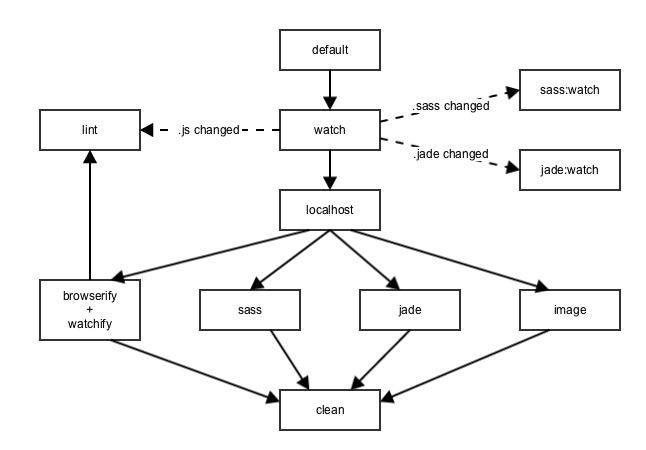
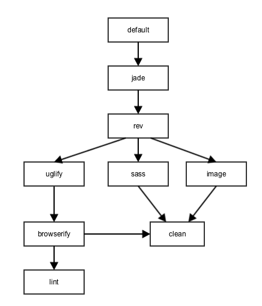

gulp-sass-jade-starter
======================

Starter Gulp project with examples of how to accomplish some common tasks and workflows.

Includes the following tools, tasks, and workflows:

- [SASS](http://sass-lang.com/) with [autoprefixer](https://github.com/sindresorhus/gulp-autoprefixer)
- [Browserify](http://browserify.org/) using [jadeify](https://github.com/domenic/jadeify) transform
- [Watchify](https://github.com/substack/watchify) (caching version of browserify for super fast rebuilds)
- [BrowserSync](http://browsersync.io) for live reloading and a static server
- [Image optimization](https://www.npmjs.com/package/gulp-imagemin)
- Separate compression task using [Uglify.js](https://github.com/terinjokes/gulp-uglify) for production builds
- Static asset revisioning by appending content hash to filenames using [gulp-rev](https://github.com/sindresorhus/gulp-rev)

- - -

## Installation

If you've never used Node or npm before, you'll need to install Node.
If you use homebrew, do:

```
brew install node
```

Otherwise, you can download and install from [here](http://nodejs.org/download/).

#### Install npm dependencies
```
npm install
```

This runs through all dependencies listed in `package.json` and downloads them to a `node_modules` folder in your project directory.

#### The `gulp` command
To run the version of gulp installed local to the project, in the root of your this project, you'd run

```
./node_modules/.bin/gulp
```

**WAT.** Why can't I just run `gulp`? Well, you could install gulp globally with `npm install -g gulp`, which will add the gulp script to your global bin folder, but it's always better to use the version that's specified in your project's package.json.  My solution to this is to simply alias `./node_modules/.bin/gulp` to `gulp`. Open up `~/.zshrc` or `~./bashrc` and add the following line:

```
alias gulp='node_modules/.bin/gulp'
```
Now, running `gulp` in the project directory will use the version specified and installed from the `package.json` file.

- - -

## Development

```shell
gulp
```

This will run the `default` gulp task defined in `gulp/tasks/default.js`.
Without further arguments, the task is run in development mode, where it has these dependencies:



- The `clean` task cleans your dist folder
- `lint` checks the `.js` files in both source and gulp directories for codestyle validations (rules are defined in `.jscsrc` and `.jshintrc`) and shows them on both the console and the operating system notification area
- `image` copies images from source to dist folder
- `jade` compiles `index.jade` from source to `index.html` in dist
- `sass` compiles `.sass` files from source to a single `.css` files with inline sourcemap in dist
- `browserify` runs using `watchify` and the `jadeify` transform, compiling `app.js` from source with all its dependencies, including jade templates, to a single `app.js` file with inline sourcemap in dist
- `localhost` boots up a local web server that serves your dist folder at `localhost:3000`
- `watch` starts watching source files and will re-run the appropriate tasks when those files change (excluding the compilation of `.js` files, which is handled by `watchify`

- - -

## Starting a production build

```shell
gulp --prod
```

This will run the default task defined in `gulp/tasks/default.js` in production mode, which has these task dependencies:



- The `clean` task cleans your dist folder
- `lint` checks the `.js` files in both source and gulp directories for codestyle validations (rules are defined in `.jscsrc` and `.jshintrc`) and cancels the build when an error is encountered
- `image` places minified copies of images from source folder in dist folder
- `sass` compiles `.sass` files from source to a `.css` files with a sourcemap comment and corresponding `.css.map` files
- `browserify` runs using the `jadeify` transform, compiling `app.js` from source with all its dependencies, including handlebars templates, to `app.js` and `app.js.map` files in dist
- `uglify` minfies the resulting `app.js` while keeping sourcemaps intact
- `rev` appends content hashes to the filenames of all image, js and css files in dist folder, deletes the original files and writes a `rev-manifest.json` mapping the original filesnames to those with content hashes
- `jade` reads the `rev-manifest.json` and compiles `index.jade` from source to `index.html` in dist, changing the paths of the used files to the hashed ones.

## Configuration
All paths and plugin settings have been abstracted into a centralized config object in `gulp/config.js`. Adapt the paths and settings to the structure and needs of your project.